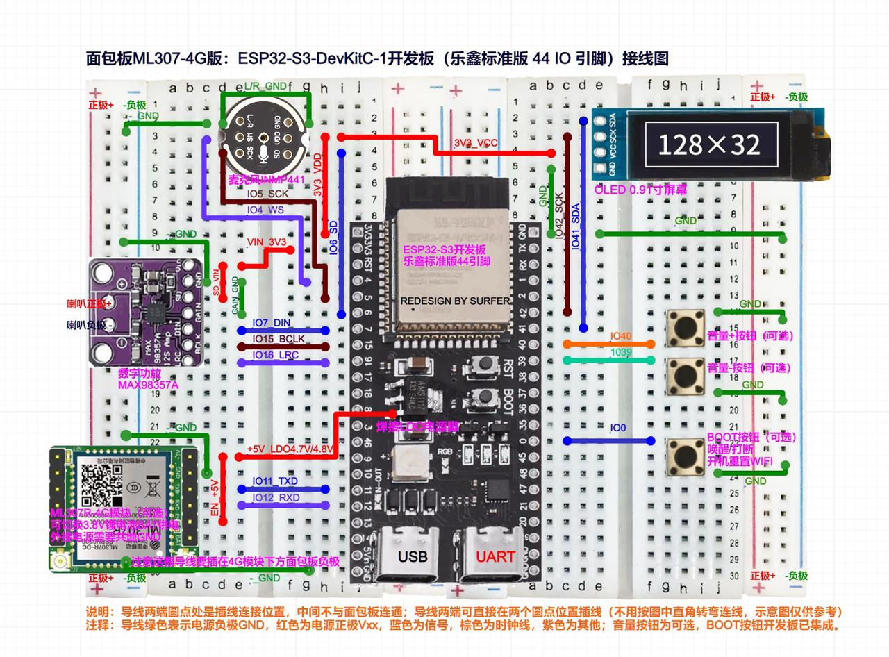

## 动手实验

### 1.硬件连接

注意：如果用户使用的MAX98357数字功放是 BGA 封装的（芯片比较上图中的小），可以不接 GAIN_GND 这根短线（上图左边绿色短线），如用户接正常工作则不用管。

### 2.烧写程序
- 串口驱动：CH343SER
- 烧写工具：flash_download_tool
- 固件版本：v1.3.0_bread-compact-wifi

### 3.配置网络

- 两个按键调节音量
- 一个按键切断输出 | 配置网络

### 4.配置智能体
https://xiaozhi.me/console/agents