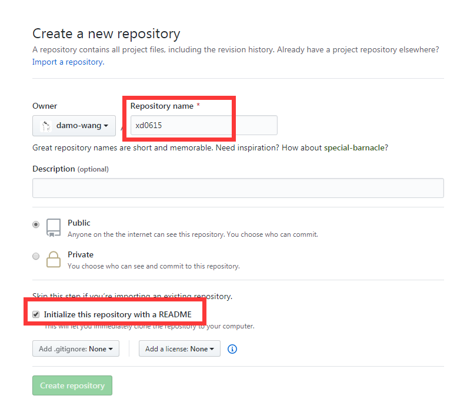
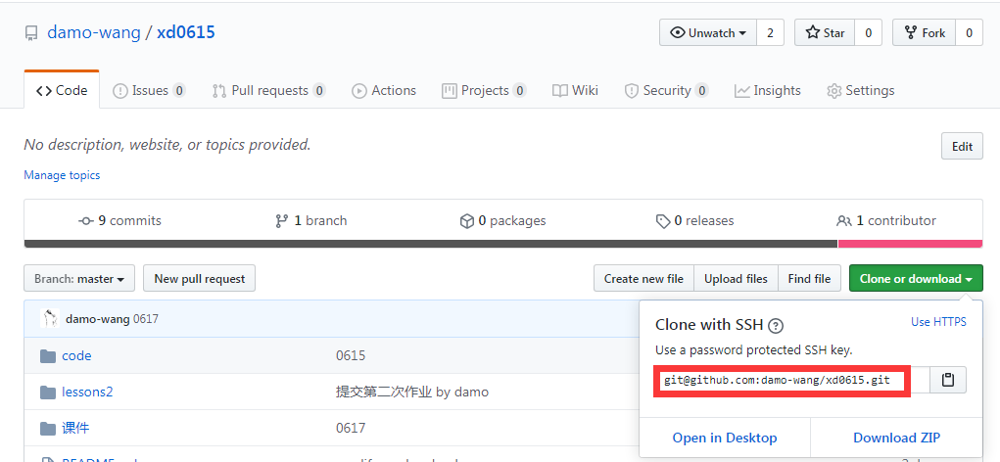
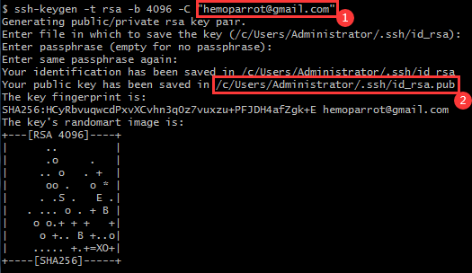
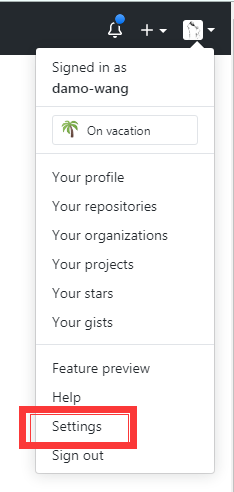
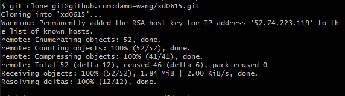

# git入门

> damo
> 2020-06-17
> 以下安装以win7-64为例，其他版本请选择对应安装包。

## 第一次创建仓库

1. 安装git，全部使用默认安装
 [git win7 64bit安装包](src/Git-2.27.0-64-bit.exe)

2. 登陆github.com，创建自己账户

3. 登陆github.com，创建一个项目，命名“xd0615”，选中“Initialize this repository with a README”


4. 得到仓库地址，如下图红框


5. 在本地机你需要下载代码的地方，点击右键，选择“git bash here”，出现的命令框中，输入下面命令：

    ```bash
    $ ssh-keygen -t rsa -b 4096 -C "your_email@example.com"
    ```

    

    > 1处是你的邮件地址
    > 2处是需要记住的地址

    输入如下命令

    ```bash
    vim /c/Users/Administrator/.ssh/id_rsa.pub
    ```

    复制打开的内容，此为你的ssh-key公钥。

6. 将你的公钥，粘贴到github.com如下位置：
    

    **New SSH key**, 添加复制的公钥。

7. 在你的电脑上git bash窗口中，继续输入如下命令，出现的提示中选择“yes”，代码开始下载。
    ```bash
    $ git clone git@github.com:damo-wang/xd0615.git
    ```
    

8. 耐心等待下载完成，第一次代码下载完成。

---

## 后续作业提交,进需要如下操作

1. 打开"xd0615"夹
2. 在文件夹内正常操作。
3. 操作完成后，在xd0615文件夹内，右键，启动“Git Bash Here”
4. 依次输入如下命令

    ```bash
    git add *
    git commit -m "第n次作业提交，你的姓名学号"
    git push
    ```

    > 第一次git commit 命令时，会要求设置user.email和user.name，使用如下两个命令设置依次即可。
    ```bash
    git config --global user.email "you@example.com"
    git config --global user.name "Your Name"
    ```
5. 完成。

> 切记，直接在本地操作即可，不要操作网页端。
