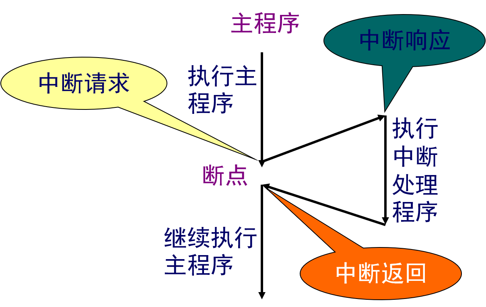
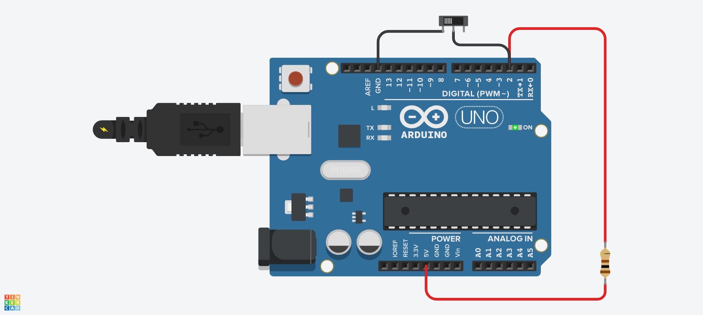

# 中断和计时器




## 重要特征

- 中断可以来自各种来源。在这种情况下，我们使用的是由数字引脚上的状态改变触发的硬件中断。
- 大多数Arduino设计有两个硬件中断（称为“interrupt0”和“interrupt1”）分别硬连接到数字I/O引脚2和3。
- Arduino Mega有六个硬件中断，包括引脚21，20，19和18上的附加中断（“interrupt2”到“interrupt5”）。
- 你可以使用称为“中断服务程序”（Interrupt Service Routine，通常称为ISR）的特殊函数来定义程序。
- 你可以定义该程序并指定上升沿，下降沿或两者的条件。在这些特定条件下，将处理中断。
- 每次在输入引脚上发生事件时，都可以自动执行该函数。


## 示例1：定时器中断

```c

#include <MsTimer2.h>     //定时器库的头文件
 
int tick = 0; //计数值
 
//中断服务程序
void onTimer()
{
  Serial.print("timer ");
  Serial.println(tick++);
}
 
void setup()
{
  Serial.begin(9600); //初始化串口
  
  MsTimer2::set(1000, onTimer); //设置中断，每1000ms进入一次中断服务程序 onTimer()
  MsTimer2::start(); //开始计时
}
 
void loop()
{
  
}

```

## 示例2：外部中断



```c
int pinInterrupt = 2; //接中断信号的脚
 
void onChange()
{
   if ( digitalRead(pinInterrupt) == LOW )
      Serial.println("Key Down");
   else
      Serial.println("Key UP");
}
 
void setup()
{
   Serial.begin(9600); //打开串口
 
   pinMode( pinInterrupt, INPUT);//设置管脚为输入
   
   //Enable中断管脚, 中断服务程序为onChange(), 监视引脚变化
   attachInterrupt( digitalPinToInterrupt(pinInterrupt), onChange, CHANGE);
}
 
void loop()
{
  // 模拟长时间运行的进程或复杂的任务。
  for (int i = 0; i < 100; i++)
  {
    // 什么都不做，等待10毫秒
    delay(10); 
  }
}
```

### 附1：attachInterrupt函数介绍

- attachInterrupt( digitalPinToInterrupt(pin) , function, mode)
- digitalPinToInterrupt(pin) ：取得引脚pin的中断号 
- function：中断发生时调用的函数，此函数必须不带参数和不返回任何值。该函数称为中断服务程序。 
- mode：定义何时发生中断以下四个contstants预定有效值：
  - LOW 当引脚为低电平时，触发中断
  - CHANGE 当引脚电平发生改变时，触发中断
  - RISING 当引脚由低电平变为高电平时，触发中断
  - FALLING 当引脚由高电平变为低电平时，触发中断.

### 附2： 注意事项

- 在中断服务程序中，不能使用delay()函数和millis()函数。因为他们无法在中断服务程序中正常工作。delayMicroseconds()可以在中断服务程序中正常工作。
- 中断服务程序应尽量保持简单短小。否则可能会影响Arduino工作。
- 中断服务程序中涉及的变量应声明为**volatile**类型。
- 中断服务程序不能返回任何数值。所以应尽量在中断服务程序中使用全局变量。


## 作业

1. 1位7段数码管，每秒数码管数字加1,0-9循环。
2. 按下按键后，数码管数字清零，重新开始。