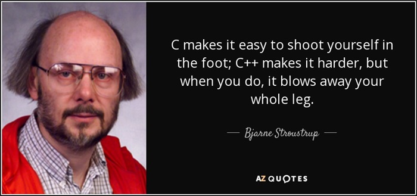

# 开源代码

## c plus plus

在c基础上，增加了class，并进行了其他一些优化。



## 学习资料

[https://www.programiz.com/cpp-programming](https://www.programiz.com/cpp-programming)

```cpp
class className
   {
   // some data
   // some functions
   };
```

```cpp
class Test
{
    private:
        int data1;
        float data2;  

    public:  
        void function1()
        {   data1 = 2;  } 

        float function2()
        { 
            data2 = 3.5;
            return data2;
        }
   };
```

```cpp
#include <iostream>
using namespace std;

class Area
{
    private:
       int length;
       int breadth;

    public:
       // Constructor
       Area(): length(5), breadth(2){ }

       void GetLength()
       {
           cout << "Enter length and breadth respectively: ";
           cin >> length >> breadth;
       }

       int AreaCalculation() {  return (length * breadth);  }

       void DisplayArea(int temp)
       {
           cout << "Area: " << temp;
       }
};

int main()
{
    Area A1, A2;
    int temp;

    A1.GetLength();
    temp = A1.AreaCalculation();
    A1.DisplayArea(temp);

    cout << endl << "Default Area when value is not taken from user" << endl;

    temp = A2.AreaCalculation();
    A2.DisplayArea(temp);

    return 0;
}
```

```cpp
// Source Code to demonstrate the working of overloaded constructors
#include <iostream>
using namespace std;

class Area
{
    private:
       int length;
       int breadth;

    public:
       // Constructor with no arguments
       Area(): length(5), breadth(2) { }

       // Constructor with two arguments
       Area(int l, int b): length(l), breadth(b){ }

       void GetLength()
       {
           cout << "Enter length and breadth respectively: ";
           cin >> length >> breadth;
       }

       int AreaCalculation() {  return length * breadth;  }

       void DisplayArea(int temp)
       {
           cout << "Area: " << temp << endl;
       }
};

int main()
{
    Area A1, A2(2, 1);
    int temp;

    cout << "Default Area when no argument is passed." << endl;
    temp = A1.AreaCalculation();
    A1.DisplayArea(temp);

    cout << "Area when (2,1) is passed as argument." << endl;
    temp = A2.AreaCalculation();
    A2.DisplayArea(temp);

    return 0;
}
```


## 演示一个库函数的实现。

## 阅读开源代码

## 大作业介绍
0. 作业描述：
- 使用CD4511控制两个7位数码管，能够从00-99循环显示，每秒更新一次。
- 用到2个7位数码管
- 两个CD4511
- 用到计时器
- 通过按键对计数器清零，清零后重新开始计数。
1. 在仓库中个，创建“zuoye”文件夹。
2. 将上述原理图存储为png格式
3. 将上述代码存储为.c格式
4. 将上述文件夹，更新到github仓库内。
5. 7月31日前完成。