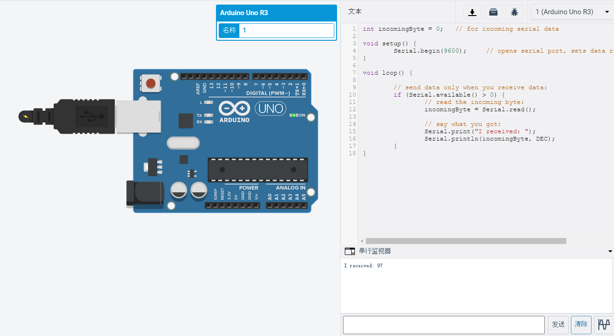

---
presentation:
  width: 1024
  height: 800
---

<!-- slide -->

# arduino与PC互动
> damo
> 开源硬件第三讲

<!-- slide -->

##　串口

Serial是一个定义好的class
默认已经实例化

<!-- slide -->

## 常用函数

begin()
available()
read()
println()
> 其他见参考文档

<!-- slide -->

## 实例

```cpp
int incomingByte = 0;   // for incoming serial data

void setup() {
        Serial.begin(9600);     // opens serial port, sets data rate to 9600 bps
}

void loop() {

        // send data only when you receive data:
        if (Serial.available() > 0) {
                // read the incoming byte:
                incomingByte = Serial.read();

                // say what you got:
                Serial.print("I received: ");
                Serial.println(incomingByte, DEC);
        }
}
```

<!-- slide -->

## 电路图



<!-- slide -->

## 作业
完成串口控制双电机代码，和电路图一起上传github。

<!-- slide -->

## Thanks！