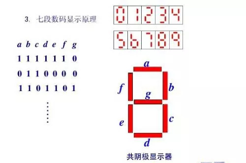
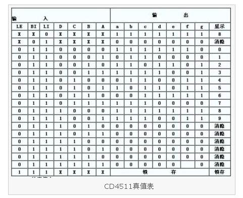

# 数码管使用

> damo
> 2020-06-20

## 7位数码管实例



> 思考：串口输入数字，显示对应数字。


## CD4511使用


- lamp test //低电平有效
- Blanking test //低电平有效
- Store




```cpp
#define IN1 2
#define IN2 3
#define IN3 4
#define IN4 5

#define S1 8
#define S2 9
#define S3 10
#define S4 11

#define LT 6
#define BT 7
void setup()
{
  pinMode(IN1, OUTPUT);//输入1
  pinMode(IN2, OUTPUT);//输入2
  pinMode(IN3, OUTPUT);//输入3
  pinMode(IN4, OUTPUT);//输入4
  pinMode(S1, OUTPUT);//片选1
  pinMode(S2, OUTPUT);//片选2
  pinMode(S3, OUTPUT);//片选3
  pinMode(S4, OUTPUT);//片选4
  
  pinMode(LT,OUTPUT);//测试
  pinMode(BT,OUTPUT);//消隐
  
  digitalWrite(LT,HIGH);
  digitalWrite(BT,HIGH);
  
  digitalWrite(S1,HIGH);
  digitalWrite(S2,HIGH);
  digitalWrite(S3,HIGH);
  digitalWrite(S4,HIGH);
  
  digitalWrite(S1,LOW);
  digitalWrite(IN1,HIGH);
  digitalWrite(IN2,LOW);
  digitalWrite(IN3,LOW);
  digitalWrite(IN4,LOW);
  digitalWrite(S1,HIGH);
  
    digitalWrite(S2,LOW);
  digitalWrite(IN1,LOW);
  digitalWrite(IN2,HIGH);
  digitalWrite(IN3,LOW);
  digitalWrite(IN4,LOW);
  digitalWrite(S2,HIGH);
  
    digitalWrite(S3,LOW);
  digitalWrite(IN1,HIGH);
  digitalWrite(IN2,HIGH);
  digitalWrite(IN3,LOW);
  digitalWrite(IN4,LOW);
  digitalWrite(S3,HIGH);
  
    digitalWrite(S4,LOW);
  digitalWrite(IN1,LOW);
  digitalWrite(IN2,LOW);
  digitalWrite(IN3,HIGH);
  digitalWrite(IN4,LOW);
  digitalWrite(S4,HIGH);
}

void loop()
{ 
}
```


## 作业

将上述三个代码，连同电路图，上传github。


## Thanks