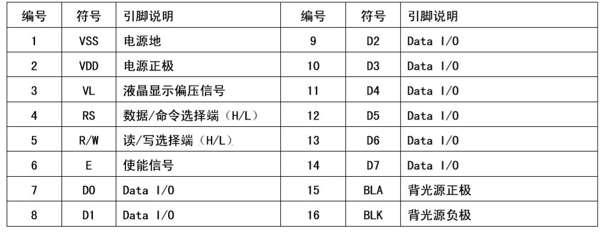

# LCD控制

> damo
> 2020-06-20

### 硬件参数

1. 显示容量：16×2个字符
2. 芯片工作电压：4.5—5.5V
3. 工作电流：2.0mA（5.0V）
4. 模块最佳工作电压：5.0V
5. 字符尺寸：2.95×4.35（W×H）mm

### 引脚定义



> 1、2为电源正负
> 15、16为背光源正负
> 7-14为数字IO

### 示例1：LCD Hello World

- 实物图


- 电路图


- 代码

```cpp
/*
  LiquidCrystal Library - Hello World

 Demonstrates the use a 16x2 LCD display.  The LiquidCrystal
 library works with all LCD displays that are compatible with the
 Hitachi HD44780 driver. There are many of them out there, and you
 can usually tell them by the 16-pin interface.

 This sketch prints "Hello World!" to the LCD
 and shows the time.

  The circuit:
 * LCD RS pin to digital pin 12
 * LCD Enable pin to digital pin 11
 * LCD D4 pin to digital pin 5
 * LCD D5 pin to digital pin 4
 * LCD D6 pin to digital pin 3
 * LCD D7 pin to digital pin 2
 * LCD R/W pin to ground
 * LCD VSS pin to ground
 * LCD VCC pin to 5V
 * 10K resistor:
 * ends to +5V and ground
 * wiper to LCD VO pin (pin 3)

 Library originally added 18 Apr 2008
 by David A. Mellis
 library modified 5 Jul 2009
 by Limor Fried (http://www.ladyada.net)
 example added 9 Jul 2009
 by Tom Igoe
 modified 22 Nov 2010
 by Tom Igoe

 This example code is in the public domain.

 http://www.arduino.cc/en/Tutorial/LiquidCrystal
 */

// include the library code:
#include <LiquidCrystal.h>

// initialize the library with the numbers of the interface pins
LiquidCrystal lcd(12, 11, 5, 4, 3, 2);

void setup() {
  // set up the LCD's number of columns and rows:
  lcd.begin(16, 2);
  // Print a message to the LCD.
  lcd.print("hello, world!");
}

void loop() {
  // set the cursor to column 0, line 1
  // (note: line 1 is the second row, since counting begins with 0):
  lcd.setCursor(0, 1);
  // print the number of seconds since reset:
  lcd.print(millis() / 1000);
}
```

### 示例2：串口操作LCD
```cpp
/*
  LiquidCrystal Library - Serial Input

 Demonstrates the use a 16x2 LCD display.  The LiquidCrystal
 library works with all LCD displays that are compatible with the
 Hitachi HD44780 driver. There are many of them out there, and you
 can usually tell them by the 16-pin interface.

 This sketch displays text sent over the serial port
 (e.g. from the Serial Monitor) on an attached LCD.

 The circuit:
 * LCD RS pin to digital pin 12
 * LCD Enable pin to digital pin 11
 * LCD D4 pin to digital pin 5
 * LCD D5 pin to digital pin 4
 * LCD D6 pin to digital pin 3
 * LCD D7 pin to digital pin 2
 * LCD R/W pin to ground
 * 10K resistor:
 * ends to +5V and ground
 * wiper to LCD VO pin (pin 3)

 Library originally added 18 Apr 2008
 by David A. Mellis
 library modified 5 Jul 2009
 by Limor Fried (http://www.ladyada.net)
 example added 9 Jul 2009
 by Tom Igoe
 modified 22 Nov 2010
 by Tom Igoe

 This example code is in the public domain.

 http://www.arduino.cc/en/Tutorial/LiquidCrystalSerial
 */

// include the library code:
#include <LiquidCrystal.h>

// initialize the library with the numbers of the interface pins
LiquidCrystal lcd(12, 11, 5, 4, 3, 2);

void setup() {
  // set up the LCD's number of columns and rows:
  lcd.begin(16, 2);
  // initialize the serial communications:
  Serial.begin(9600);
}

void loop() {
  // when characters arrive over the serial port...
  if (Serial.available()) {
    // wait a bit for the entire message to arrive
    delay(100);
    // clear the screen
    lcd.clear();
    // read all the available characters
    while (Serial.available() > 0) {
      // display each character to the LCD
      lcd.write(Serial.read());
    }
  }
}
```